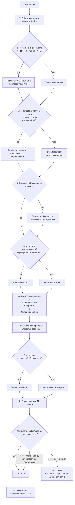

# /postanovka — команды и флоу

Служебная документация к скиллу. Сам скилл её не читает: точка входа —
только `SKILL.md`. Этот файл для человека.

## Команды

Скилл в Claude Code — это **одна** слэш-команда, а не набор. У `postanovka`
команда ровно одна:

| Команда | Что делает |
| --- | --- |
| `/postanovka` | Пишет постановку по текущему диалогу и публикует в `.scratch/<slug>/spec.md` |

Аргументы не обязательны. Если передать текст (`/postanovka фильтр по маркировке`),
он трактуется как уточнение темы, а не как единственный источник: скилл всё равно
читает весь диалог.

`disable-model-invocation: true` — скилл **не запускается сам**. Модель не вызовет
его, увидев подходящую задачу; нужен явный ввод `/postanovka`. Это сделано намеренно:
артефакт публикуется в файл, и самопроизвольная запись нежелательна.

### Соседние команды

Отдельные скиллы, не часть этого:

| Команда | Источник | Отношение к `/postanovka` |
| --- | --- | --- |
| `/to-spec` | mattpocock/skills | Оригинал, от которого форкнут. Даёт англоязычную спеку Pocock. Оставлен как эталон |
| `/to-tickets` | mattpocock/skills | Следующий шаг: режет постановку на тикеты с графом блокировок |
| `/setup-matt-pocock-skills` | mattpocock/skills | Разовая настройка трекера. Создаёт `docs/agents/issue-tracker.md`, на который опирается публикация |
| `/use-case` | личный | Формальные ВИ по Коберну с таблицами FR/NFR. Другой жанр, не пересекается |

Типовая цепочка: обсудили задачу → `/postanovka` → `/to-tickets`.

## Полный флоу

### Разбор шагов

**1. Сбор источников.** Всё, что попадёт в артефакт, должно прослеживаться до
реплики пользователя, приложенного файла или кода. Утверждение, не выводимое ни
из чего из этого, считается выдумкой — даже если оно очевидно.

**2. Репозиторий.** Исследуется не всегда. Критерий: хотя бы один термин из
диалога встречается в `CONTEXT.md` / `CONTEXT-MAP.md` или в заголовке ADR.
Не совпало — шаг пропускается молча, без оговорок в артефакте. Это нужно, потому
что постановка часто описывает систему, которой в репозитории нет: сайт, 1С,
чужую админку.

**3. Готовая структура.** Ключевая развилка. Если вы принесли текст с блоками
Цель / Контекст / AS-IS / TO-BE, скилл переключается в режим оформителя:
переносит абзацы по разделам, строит таблицы, дописывает недостающие разделы —
но не переписывает ваши формулировки и не заменяет ваши термины своими.

**4. Вопросы.** Единственное место, где скилл спрашивает. Условие узкое: непонятно,
ЧТО меняется или ЗАЧЕМ. Не более пяти вопросов, одним списком, один раз. Если
ответа не последовало — файл всё равно пишется, вопросы уходят в раздел с пометкой
«блокирует», статус становится `needs-info`. Повторно те же вопросы не задаются.

**5. AS-IS.** Опционален. Включается, только если меняется существующий сценарий
И его текущее поведение достоверно известно. Не включается для новой фичи, для
точечного изменения («добавить кнопку») и когда данных о текущем поведении нет.
Опущенный раздел просто отсутствует — заглушка «неприменимо» не пишется.

**6. Порядок написания.** Жёсткий: сначала TO-BE как сценарий во времени, затем
свёртка в требования как набор инвариантов, затем проекция требований в критерии.
Обратный порядок даёт набор пожеланий вместо проверяемых требований.

**7. Открытые вопросы.** Раздел появляется, только если есть что спросить.
Противоречия источника не склеиваются молча: расхождение «заказы» / «возвратные
накладные», два значения справочника с одинаковым описанием, названный элемент
без описания поведения — всё это становится закрытым вопросом с вариантами ответа.

**8. Самопроверка.** 12 пунктов, прогоняются до записи файла. Проверяют порядок
разделов, отсутствие user stories, наличие метрики с формулой, покрытие требований
критериями, корректность нумерации и таблиц, отсутствие путей к файлам и кода.

**9. Сводка.** В чат, не в файл. Показывает, что перенесено дословно, что дописано
скиллом и откуда выведено, включён ли AS-IS и почему. Нужна, чтобы вы видели место
для отклонения дописанного, а сам артефакт оставался чистым.

## Куда пишется

| | |
| --- | --- |
| Путь | `.scratch/<feature-slug>/spec.md` |
| Конвенция | `docs/agents/issue-tracker.md` |
| Имя файла | `spec.md` — это адрес, жанр задаёт заголовок `# Постановка:` внутри |
| Slug | Транслитерация первых 4 значащих слов заголовка, до 40 символов |
| Статус | `ready-for-agent` или `needs-info`, строкой сразу под заголовком |

Пример slug: `Постановка: приоритизация промо-окна «Колесо» над сценарием выбора
города (десктоп)` → `prioritizaciya-promo-okna-koleso`.

Если конвенций трекера в проекте нет — скилл пишет по той же схеме от корня и
одной строкой сообщает, что конвенции ставит `/setup-matt-pocock-skills`.

## Структура артефакта

| Раздел | Обязателен | Форма |
| --- | --- | --- |
| Заголовок `# Постановка: …` | да | Отглагольное существительное + объект в «ёлочках» |
| `Status:` | да | Первая непустая строка после заголовка |
| Цель | да | Инфинитив + буллиты-потери + метрика с формулой |
| Контекст | да | Сплошная проза, без буллитов |
| Процесс AS-IS | **нет** | 5–9 нумерованных шагов |
| Процесс TO-BE | да | 5–9 шагов + абзац «Что меняется по сути» |
| Требования | да | Сквозная нумерация, плоские пункты или `N.M.` с таблицами |
| Критерии приёмки | да | Буллиты, по одному на требование |
| Открытые вопросы | нет | Появляется только при наличии вопросов |

## Отличия от оригинального /to-spec

| | `/to-spec` | `/postanovka` |
| --- | --- | --- |
| Язык | Английский | Русский |
| Разделы | Problem / Solution / User Stories / Implementation / Testing / Out of Scope / Further Notes | Цель / Контекст / AS-IS / TO-BE / Требования / Критерии приёмки |
| User stories | Обязательны, «extremely extensive» | Не пишутся вообще |
| Швы для тестирования | Согласуются с пользователем до написания | Убраны — не жанр аналитика |
| Вопросы пользователю | Запрещены жёстко | Разрешены один раз при блокирующем пробеле |
| Вне скоупа | Отдельный раздел | Триада: обоснование в Контексте → негативное требование → зеркальный критерий |
| Таблицы данных | Не предусмотрены | Обязательны для однородных перечислений |
| Объём | Не ограничен | ~600–1000 слов, до 10 требований |

## Правка скилла

Файл: `~/.claude/skills/postanovka/SKILL.md`.

`Source: local` — скилл не привязан к апстриму, `npx skills update` его не тронет.
Изменения подхватываются после перезапуска сессии.
