# /postanovka — команды и флоу

Служебная документация к скиллу. Сам скилл её не читает: точка входа —
`SKILL.md`, из него по результату калибровки подгружается один файл профиля.
Этот файл для человека.

## Команды

Скилл в Claude Code — это **одна** слэш-команда, а не набор. У `postanovka`
команда ровно одна:

| Команда | Что делает |
| --- | --- |
| `/postanovka` | Пишет постановку по текущему диалогу и публикует в `.scratch/<slug>/spec.md` |

Аргументы не обязательны. Если передать текст (`/postanovka фильтр по маркировке`),
он трактуется как уточнение темы, а не как единственный источник: скилл всё равно
читает весь диалог. Слова «коротко» или «подробно» в аргументе задают профиль
напрямую, минуя рубрику.

`disable-model-invocation: true` — скилл **не запускается сам**. Модель не вызовет
его, увидев подходящую задачу; нужен явный ввод `/postanovka`. Это сделано намеренно:
артефакт публикуется в файл, и самопроизвольная запись нежелательна.

### Соседние команды

Отдельные скиллы, не часть этого:

| Команда | Источник | Отношение к `/postanovka` |
| --- | --- | --- |
| `/to-spec` | mattpocock/skills | Оригинал, от которого форкнут. Даёт англоязычную спеку Pocock. Оставлен как эталон |
| `/to-tickets` | mattpocock/skills | Следующий шаг: режет постановку на тикеты с графом блокировок |
| `/setup-matt-pocock-skills` | mattpocock/skills | Разовая настройка трекера. Создаёт `docs/agents/issue-tracker.md`, на который опирается публикация |
| `/use-case` | личный | Формальные ВИ по Коберну с таблицами FR/NFR. Другой жанр, не пересекается |

Типовая цепочка: обсудили задачу → `/postanovka` → `/to-tickets`.

## Два профиля

Объём постановки задаёт размер задачи. Профиль выбирается автоматически на втором
шаге и называется первой строкой сводки в чат — чтобы решение можно было отклонить
одной репликой («перепиши компактно»).

| | Компактный | Детальный |
| --- | --- | --- |
| Файл | `profiles/compact.md` | `profiles/full.md` |
| Когда | точечная доработка: один элемент, одно поведение, сценария «до» нет | меняется сценарий, есть роли, состояния, ветвления, интеграции, норматив |
| Разделы | Кратко, Контекст, Требования, Критерии приёмки | Кратко, Цель, Контекст, AS-IS (опц.), TO-BE, Требования, Критерии приёмки |
| Объём | до ~300 слов | ~600–1000 слов |
| Требований | до 6 | до 10 |
| Метрика | не выводится; авторская переносится дословно в «Кратко» | «Целевая метрика» с формулой и сегментом либо «Критерий достижения» |

**Компактный — та же строгость в меньшем объёме.** Сокращается проза, а не
проверяемость: запрет на выдумку, вынос противоречий в «Открытые вопросы», правила
таблиц и критериев приёмки — общие и действуют одинаково.

**Рубрика.** Компактный профиль выбирается, только если выполнены все четыре
условия: изменение атомарное; поведение описывается одной фразой; сценария «до»
не существует; не затронуты интеграции, права, расчёты, миграции и нормативы.
Нарушено хоть одно — детальный. Асимметрия намеренная: недосказанная постановка
стоит дороже избыточной.

**Старше рубрики** три входных условия: принесён аналог — профиль аналога;
принесена готовая структура Цель/Контекст/AS-IS/TO-BE — детальный; названа форма
(«коротко», «подробно») — как названо. В этих случаях скилл не спрашивает: форма
уже названа.

**Решает пользователь.** Во всех остальных случаях скилл перед началом письма
называет рекомендацию и ждёт ответа — одним сообщением, вместе с блокирующими
вопросами, если они есть:

```
Профиль: рекомендую компактный — изменение атомарное, сценария «до» нет.
Компактный: Кратко, Контекст, Требования, Критерии приёмки — до ~300 слов.
Детальный: плюс Цель с метрикой, Процесс AS-IS и Процесс TO-BE — ~600–1000 слов.
Пишу компактный? Ответьте «детальный», если нужен полный разбор.
```

Ответа не последовало — пишется рекомендованный профиль, и в сводке сказано, что
выбор был за скиллом. Выбран другой — пишется он, без возражений; расхождение с
рекомендацией уходит строкой в сводку. Названо отклонение («компактный, но с
«Целью»») — выполняется дословно.

**Эскалация.** Если признаки детального профиля вылезли уже при письме —
требований больше шести или поведение не объяснить без последовательности шагов, —
постановка пишется заново по детальному профилю, а не дописывается. **Эскалация
работает только над рекомендацией:** профиль, выбранный вами, не переигрывается —
все требования пишутся целиком, а выход за норму называется в сводке. Обратной
эскалации нет: короткая детальная постановка в компактную не переписывается.

## Блок «Кратко»

Первый раздел артефакта в обоих профилях, сразу после `Status:`. 3–6 строк, каждая —
слот с точным значением:

```markdown
## Кратко

* **Что:** в футер добавляется ссылка **«Новости»**.
* **Где:** блок **«Компания»**, **третьим пунктом** списка.
* **Адрес:** **https://www.petshop.ru/news/**.
* **Платформы:** десктоп и мобильный веб, все страницы сайта.
* **Зачем:** ссылки на раздел новостей нет ни в футере, ни на главной.
```

Слоты — меню, а не комплект: слот без факта в источнике не пишется и заглушкой не
заменяется. Блок — **проекция, а не источник**: каждый его факт присутствует ниже,
в «Требованиях» (а «Зачем» — в «Цели» или «Контексте»). Пишется последним, когда
тело постановки готово. Чисел-целей в нём нет — метрика живёт только в «Цели».

## Выделение жирным

Жирное — навигация по точным значениям, а не эмфаза.

| | |
| --- | --- |
| Выделяется | имя элемента, место и позиция, адрес, число, срок, значение справочника, платформа, отрицание в негативном требовании |
| Где допустимо | «Кратко», «Требования», «Критерии приёмки» |
| Где запрещено | «Цель», «Контекст», AS-IS, TO-BE, ячейки таблиц |
| Норма | не более двух выделений в пункте; выделено больше половины строки — снять целиком |
| Не выделяется | целые предложения, модальность «должен / необходимо», слово, повторяющееся в каждом пункте |

## Полный флоу

```mermaid
flowchart TD
    A["/postanovka"] --> B["1. Собрать источники<br/>диалог + файлы"]
    B --> C{"2. Калибровка:<br/>изменение атомарное,<br/>сценария «до» нет,<br/>нет интеграций и прав?"}
    C -->|да| D["Рекомендация:<br/>компактный"]
    C -->|нет| E["Рекомендация:<br/>детальный"]
    D --> F
    E --> F{"3. Термин из диалога есть<br/>в CONTEXT.md или ADR?"}
    F -->|да| G["Прочитать CONTEXT.md<br/>и релевантные ADR"]
    F -->|нет| H["Пропустить молча"]
    G --> I
    H --> I{"4. У пользователя уже есть<br/>структура Цель/Контекст/AS-IS?"}
    I -->|да| J["Режим оформителя:<br/>переносить, не переписывать"]
    I -->|нет| K["Режим автора:<br/>синтез из диалога"]
    J --> L
    K --> L{"5. Понятно, ЧТО меняется<br/>и ЗАЧЕМ?"}
    L -->|нет| M["Сформулировать<br/>до 5 закрытых вопросов"]
    L -->|да| N
    M --> N{"6. Форма уже названа<br/>аналогом или словами<br/>«коротко» / «подробно»?"}
    N -->|да| O["Спросить только<br/>блокирующие вопросы"]
    N -->|нет| P["Спросить одним сообщением:<br/>рекомендация профиля<br/>+ блокирующие вопросы"]
    P --> Q{"Ответ о профиле"}
    Q -->|"выбран другой"| R["Пишется выбранный,<br/>расхождение → в сводку"]
    Q -->|"подтверждён<br/>или ответа нет"| S["Пишется рекомендованный"]
    O --> T
    R --> T
    S --> T["7. Прочитать ОДИН файл профиля:<br/>profiles/full.md или compact.md"]
    T --> U["8. Тело постановки<br/>по шаблону профиля"]
    U --> V{"Вылезли признаки<br/>детального профиля?"}
    V -->|"да, профиль не выбирал<br/>пользователь"| T
    V -->|нет| W["9. Блок «Кратко» —<br/>проекция готового тела"]
    W --> X["10. Расхождения и пробелы<br/>→ Открытые вопросы"]
    X --> Y{"Есть вопрос<br/>с пометкой «блокирует»?"}
    Y -->|да| Z["Status: needs-info"]
    Y -->|нет| AA["Status: ready-for-agent"]
    Z --> AB["11. Самопроверка:<br/>общая + профильная"]
    AA --> AB
    AB --> AC{"Файл .scratch/slug/spec.md<br/>уже существует?"}
    AC -->|нет| AD["Записать"]
    AC -->|"есть, та же задача,<br/>начинается с # Постановка:"| AD
    AC -->|"есть, чужой скилл"| AE["Не трогать.<br/>Спросить: перезаписать<br/>или новая папка"]
    AD --> AF["12. Сводка в чат:<br/>профиль + что дописано"]
```



### Разбор шагов

**1. Сбор источников.** Всё, что попадёт в артефакт, должно прослеживаться до
реплики пользователя, приложенного файла или кода. Утверждение, не выводимое ни
из чего из этого, считается выдумкой — даже если оно очевидно.

**2. Калибровка.** Определяется рекомендация по четырём условиям рубрики. Файл
профиля на этом шаге ещё не читается: сначала ответ пользователя.

**3. Репозиторий.** Исследуется не всегда. Критерий: хотя бы один термин из
диалога встречается в `CONTEXT.md` / `CONTEXT-MAP.md` или в заголовке ADR.
Не совпало — шаг пропускается молча, без оговорок в артефакте. Это нужно, потому
что постановка часто описывает систему, которой в репозитории нет: сайт, 1С,
чужую админку.

**4. Готовая структура.** Ключевая развилка. Если вы принесли текст с блоками
Цель / Контекст / AS-IS / TO-BE, скилл переключается в режим оформителя:
переносит абзацы по разделам, строит таблицы, дописывает недостающие разделы —
но не переписывает ваши формулировки и не заменяет ваши термины своими.

**5. Блокирующий пробел.** Непонятно, ЧТО меняется или ЗАЧЕМ — формулируется не
более пяти закрытых вопросов с вариантами ответа. Задаются они не здесь, а на
следующем шаге, чтобы вся переписка уместилась в одно сообщение.

**6. Вопрос о профиле.** Единственное место, где скилл спрашивает. Рекомендация,
два профиля одной строкой каждый, прямой вопрос — и следом блокирующие вопросы,
если они есть. Один раз, одним сообщением. Форма уже названа аналогом или словами
«коротко» / «подробно» — про профиль не спрашивают вовсе. Ответа не последовало —
файл всё равно пишется: профиль берётся рекомендованный, неотвеченные блокирующие
вопросы уходят в раздел «Открытые вопросы» с пометкой «блокирует», статус
становится `needs-info`. Повторно те же вопросы не задаются.

**7. Чтение профиля.** Читается ровно один файл. Второй не читается намеренно:
чужой шаблон в контексте тянет постановку к чужой форме — именно поэтому профили
разнесены по файлам, а не сложены в один.

**8. Тело постановки.** В детальном профиле порядок жёсткий: сначала TO-BE как
сценарий во времени, затем свёртка в требования как набор инвариантов, затем
проекция требований в критерии. Обратный порядок даёт набор пожеланий вместо
проверяемых требований. В компактном профиле TO-BE нет — требования выводятся из
«Контекста» напрямую. AS-IS опционален и только в детальном: включается, только
если меняется существующий сценарий И его поведение достоверно известно.

**9. «Кратко».** Пишется последним, из готовых требований. Это гарантирует, что
блок не вводит фактов, которых нет в теле и которые поэтому никто не проверит.

**10. Открытые вопросы.** Раздел появляется, только если есть что спросить.
Противоречия источника не склеиваются молча: расхождение «заказы» / «возвратные
накладные», два значения справочника с одинаковым описанием, названный элемент
без описания поведения — всё это становится закрытым вопросом с вариантами ответа.

**11. Самопроверка.** Две части: общая (11 пунктов в `SKILL.md`) и профильная
(5 пунктов в файле профиля). Прогоняются до записи файла.

**12. Сводка.** В чат, не в файл. Первой строкой — профиль, кто его выбрал и по
какому признаку. Дальше: что перенесено дословно, что дописано скиллом и откуда
выведено, включён ли AS-IS. Нужна, чтобы вы видели место для отклонения
дописанного, а сам артефакт оставался чистым.

## Куда пишется

| | |
| --- | --- |
| Путь | `.scratch/<feature-slug>/spec.md` |
| Конвенция | `docs/agents/issue-tracker.md` |
| Имя файла | `spec.md` — это адрес, жанр задаёт заголовок `# Постановка:` внутри |
| Slug | Транслитерация первых 4 значащих слов заголовка, до 40 символов |
| Статус | `ready-for-agent` или `needs-info`, строкой сразу под заголовком |

Пример slug: `Постановка: приоритизация промо-окна «Колесо» над сценарием выбора
города (десктоп)` → `prioritizaciya-promo-okna-koleso`.

Если конвенций трекера в проекте нет — скилл пишет по той же схеме от корня и
одной строкой сообщает, что конвенции ставит `/setup-matt-pocock-skills`.

## Структура артефакта

| Раздел | Компактный | Детальный | Форма |
| --- | --- | --- | --- |
| Заголовок `# Постановка: …` | да | да | Отглагольное существительное + объект в «ёлочках» |
| `Status:` | да | да | Первая непустая строка после заголовка |
| Кратко | да | да | 3–6 строк-слотов с точными значениями |
| Цель | **нет** | да | Инфинитив + буллиты-потери + метрика с формулой |
| Контекст | да | да | Проза; компактный — один абзац, детальный — до 4–7 |
| Процесс AS-IS | **нет** | опционально | 5–9 нумерованных шагов |
| Процесс TO-BE | **нет** | да | 5–9 шагов + абзац «Что меняется по сути» |
| Требования | да | да | Сквозная нумерация; плоские пункты или `N.M.` с таблицами |
| Критерии приёмки | да | да | Буллиты, по одному на требование |
| Открытые вопросы | при наличии | при наличии | Закрытые вопросы с вариантами ответа |

## Отличия от оригинального /to-spec

| | `/to-spec` | `/postanovka` |
| --- | --- | --- |
| Язык | Английский | Русский |
| Разделы | Problem / Solution / User Stories / Implementation / Testing / Out of Scope / Further Notes | Кратко / Цель / Контекст / AS-IS / TO-BE / Требования / Критерии приёмки |
| User stories | Обязательны, «extremely extensive» | Не пишутся вообще |
| Швы для тестирования | Согласуются с пользователем до написания | Убраны — не жанр аналитика |
| Вопросы пользователю | Запрещены жёстко | Разрешены один раз при блокирующем пробеле |
| Вне скоупа | Отдельный раздел | Триада: обоснование в Контексте → негативное требование → зеркальный критерий |
| Таблицы данных | Не предусмотрены | Обязательны для однородных перечислений |
| Объём | Не ограничен | Два профиля: до ~300 слов и ~600–1000 слов |

## Правка скилла

| Файл | Что в нём |
| --- | --- |
| `SKILL.md` | Точка входа: процесс, калибровка и вопрос о профиле, общие правила, «Кратко», «Требования», публикация, самопроверка |
| `profiles/full.md` | Детальный профиль: нормы, шаблон, «Цель», «Контекст», AS-IS, TO-BE, образец таблицы |
| `profiles/compact.md` | Компактный профиль: нормы, шаблон, «Контекст», образец постановки целиком |

Правило разделения: правило действует в обоих профилях — в `SKILL.md`; правило
про набор разделов, объём или конкретный раздел одного профиля — в файле профиля.
Дублировать текст между профилями нельзя: разойдутся.

Установка — `~/.claude/skills/postanovka/`. `Source: local` — скилл не привязан к
апстриму, `npx skills update` его не тронет. Изменения подхватываются после
перезапуска сессии.
